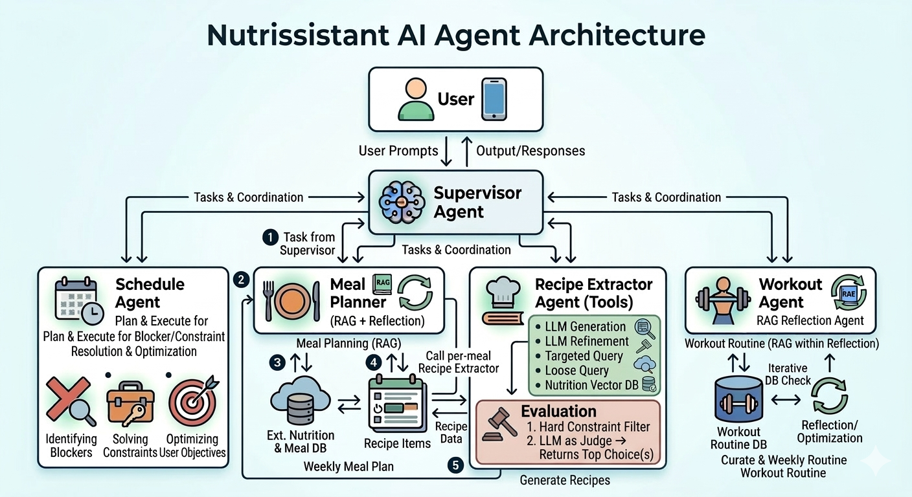

# Nutrissistant

Nutrissistant is a multi-agent wellness assistant that turns natural-language requests into actionable workout, scheduling, and lifestyle planning outputs.

## Project Overview

Nutrissistant is designed to feel like a personal wellness coordinator that can understand goals, remember user context, and turn broad requests into concrete plans.

In practice, users can write requests in natural language, for example:
- "Build me a weekly routine to lose weight."
- "Move my workout to another day."
- "Help me keep this plan realistic with my schedule."

The system then handles the planning process end to end:
1. Interprets what the user is trying to achieve.
2. Uses known profile and schedule context.
3. Produces an actionable response.
4. Returns transparent execution steps so decisions are inspectable.

Project goal:
- Provide a practical AI assistant for day-to-day wellness planning, not just a single chatbot answer.
- Combine planning, scheduling, and traceability in one user workflow.

## Architecture

### Architecture Diagram




### Agent Components

**Supervisor Agent** — Router-Orchestrator Agent

The Supervisor is the top-level control agent. It receives the raw user prompt, performs intent and context extraction, maps the request into task types (for example WORKOUT, SCHEDULE, PLAN_MEAL, FIND_RECIPE), and coordinates execution across downstream agents. It is also responsible for response composition and for emitting the step trace that explains how the final answer was produced.

**Schedule Agent** — Plan-and-Execute Agent

The Schedule Agent follows a plan-and-execute design. In the planning stage, an LLM extracts a structured action plan (`events[]`) from user language, including action type, target event, preferred day, and preferred time. In the execution stage, deterministic slot-allocation logic applies that plan against a sandbox copy of the weekly calendar, resolves feasible placements/reschedules, and then commits results to state (or returns proposal-only slots in gather mode). This design separates semantic interpretation (LLM planning) from reliable calendar mutation (rule-based execution).

**Workout Agent** — Reflection RAG Agent

The Workout Agent is a retrieval-augmented generation agent with two operation modes. For routine creation and large edits, it runs a reflection loop (`generation -> critique -> refinement`) to improve safety and alignment. For smaller updates, it uses a faster single-pass RAG generation path. It consumes schedule-derived constraints from shared context and uses vector retrieval evidence when Pinecone is configured.

**Recipe Extractor Agent** — Tool-Calling Agent (LangChain AgentExecutor)

The Recipe Extractor is a tool-using agent that can retrieve, evaluate, revise, and finalize recipes in structured JSON form. It uses a staged strategy: candidate generation/retrieval, strict filtering, quality ranking, optional revision, and finalization.

Recipe Extractor tools:
- `FREE_QUERY_DATABASE`: LLM converts free-form context into DB query parameters, then retrieves candidate recipes.
- `STRACTURED_DATABASE_QUERY`: deterministic DB filtering for explicit constraints (time, category, nutrition, ingredients).
- `USE_VECTOR_DB`: semantic nearest-neighbor retrieval over recipe embeddings.
- `LLM_GENERATION`: generates a new recipe when retrieval candidates are insufficient.
- `STRICT_EVALUATOR`: rule-based pass/fail gate (nutrition bounds, excluded ingredients, time constraints).
- `LLM_EVALUATOR`: soft scoring and ranking among valid candidates.
- `LLM_REVISER`: revises an existing recipe using feedback and constraints.
- `GET_FULL_RECEPIE_DETAILS`: final DB fetch by recipe_id for complete output payload.

**Meal Planner Agent** — Schema-Driven Planning Agent

The Meal Planner layer is defined by a strict output contract in `src/meal_planner/output_scheme.json`, including date-level meals, dish arrays, warnings, and suggestions. It standardizes how full meal plans should be represented and how dish objects should align with recipe output shape. In practice, it acts as the nutrition-plan composition contract around recipe-level generation/extraction outputs.

### Supporting Runtime Components

`api.py`
- Exposes required endpoints and standard response envelopes.
- Serves architecture image and proxies non-API traffic to Streamlit.

`state_manager.py` + `user_data.json`
- Persistent state backbone shared by supervisor and task agents.

`main.py`
- Streamlit UI for prompt submission, response display, and step trace inspection.

### Runtime Sequence

1. Client sends prompt to `POST /api/execute`.
2. API forwards prompt to supervisor orchestration.
3. Supervisor classifies tasks and extracts persistent context updates.
4. If scheduling context is needed, the Scheduling Agent runs to gather slot constraints.
5. Domain agents execute (Workout Agent, Recipe Extractor Agent, Meal Planner contract flow as applicable).
6. Supervisor commits outputs and state updates (including schedule commit when relevant).
7. API returns:
   - `response`: final natural-language output.
   - `steps`: ordered module trace for observability.

### Data Contracts Between Components

- Execute request contract:
  - Input: `{ "prompt": "..." }`
  - Output envelope: `{ "status", "error", "response", "steps" }`
- Shared context contract:
  - Contains runtime constraints (for example discovered slots and duration limits).
- Routine draft contract:
  - Structured weekly units returned by workout generation and consumed by schedule commit logic.
- Persistent state contract:
  - Single source of truth in `user_data.json` accessed through `state_manager.py`.

## API Endpoints

Base URL for local run: `http://127.0.0.1:10000`

### 1) GET /health

Purpose: service liveness check.

Example response:

```json
{
  "status": "ok"
}
```

### 2) GET /api/team_info

Purpose: returns team metadata.

Response shape:

```json
{
  "group_batch_order_number": "{batch}_{order}",
  "team_name": "Nutrissistant",
  "students": [
    { "name": "...", "email": "..." }
  ]
}
```

### 3) GET /api/agent_info

Purpose: returns model description, purpose, and usage template/examples.

Response includes:
- `description`
- `purpose`
- `prompt_template`
- `prompt_examples`

### 4) GET /api/model_architecture

Purpose: returns architecture image.

Response:
- Content-Type: `image/png`
- Body: architecture PNG

### 5) POST /api/execute

Purpose: main agent entrypoint.

Request body:

```json
{
  "prompt": "User request here"
}
```

Success response:

```json
{
  "status": "ok",
  "error": null,
  "response": "...",
  "steps": []
}
```

Error response:

```json
{
  "status": "error",
  "error": "Human-readable error",
  "response": null,
  "steps": []
}
```

## User Instructions

### Prerequisites

- Python 3.11 (project runtime target: 3.11.9)
- Populated `.env` file (copy from `.env.example`)

### Setup

```bash
pip install -r requirements.txt
cp .env.example .env
```

Fill values in `.env` for your environment.

### Run

```bash
bash start.sh
```

What this starts:
- Streamlit UI on `127.0.0.1:8501` (internal)
- FastAPI on `0.0.0.0:${PORT:-10000}`

### Basic API Checks

```bash
curl http://127.0.0.1:10000/health
curl http://127.0.0.1:10000/api/team_info
curl http://127.0.0.1:10000/api/agent_info
curl -o architecture.png http://127.0.0.1:10000/api/model_architecture
curl -X POST http://127.0.0.1:10000/api/execute \
  -H "Content-Type: application/json" \
  -d '{"prompt":"Create a weekly wellness plan"}'
```

### UI Usage

1. Open the Streamlit app in browser.
2. Enter your profile/goals in the welcome flow.
3. Use the prompt box and click Run Agent.
4. Review final response and execution trace.
5. Inspect schedule and generated plan artifacts in the UI pages.

